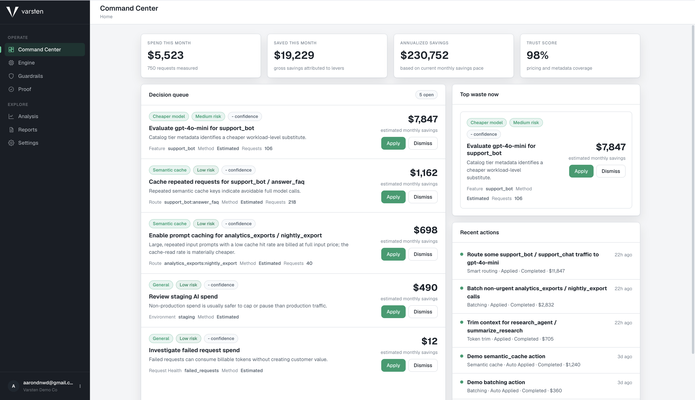
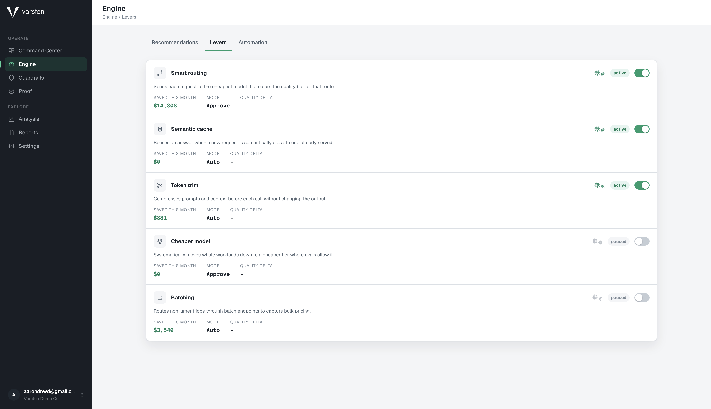
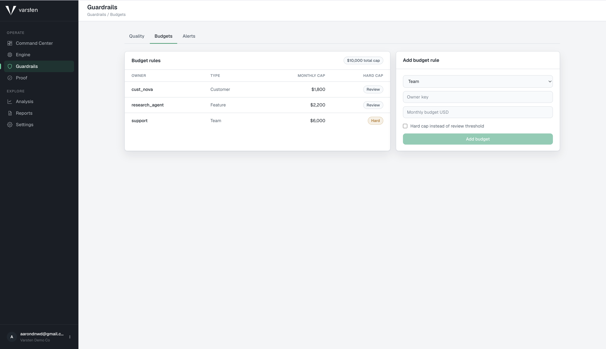
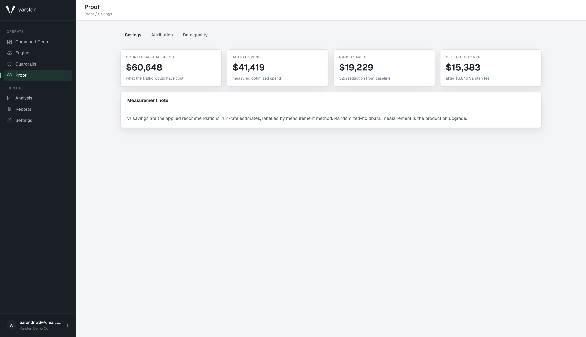

# Varsten

Varsten is an AI cost-optimization engine for companies using LLMs in any capacity. It cuts AI spend, keeps quality inside configured guardrails, and proves the savings.

Varsten ingests AI usage across products, teams, customers, models, and providers, derives trusted cost from a pricing catalog, and surfaces pricing/data-quality gaps instead of hiding them. The product value comes from what sits on top of that foundation: an engine that finds specific cuts, maps them to savings levers, lets a human approve what is not yet trusted, and shows proof of the dollars saved.

Varsten's five savings levers are smart routing, semantic cache, token trim, cheaper model, and batching.

The daily product loop is: spend comes in, the engine identifies cuts, guardrails define what is safe, a user approves or dismisses the risky work, and Proof explains the savings attribution. Analysis exists to support that loop, not to be the destination.

## Product Screenshots

### Command Center



### Savings Levers



### Guardrails



### Proof



## MVP Scope

In:

- FastAPI backend
- PostgreSQL via Docker Compose
- API-key authenticated usage ingestion
- Pydantic validation
- Authoritative cost measurement with pricing catalog, overrides, `cost_source`, and `pricing_status`
- Rule-based recommendation engine mapped to the five savings levers
- Command Center and Engine decision-loop UI
- Apply, dismiss, and status tracking for recommendations
- Proof views for estimated/backtested savings, attribution method, net-after-fee, and data quality
- Guardrails configuration for quality floors, budgets, and alerts
- Analysis views for spend, customers, and models
- Admin views for connections, API keys, team, billing, and security
- Usage explorer and setup flow as supporting/admin tools
- Inline SDK-compatible proxy for OpenAI chat completions, Anthropic Messages,
  Gemini native `generateContent`, Gemini OpenAI-compatible chat completions,
  streaming, tool calls, provider-key vaulting, and cross-provider routing audit
  records

Out for v1:

- published SDKs
- in-VPC data plane deployment
- billing-grade invoice reconciliation
- full enterprise permissions
- advanced ML forecasting

## Local Development

Start Postgres:

```bash
docker compose up db
```

Run the API from `backend/`:

```bash
uv run uvicorn app.main:app --reload
```

Health check:

```bash
curl http://localhost:8000/health
```

Provider SDK drop-in routes supported by the local API:

- OpenAI-compatible: `POST /v1/chat/completions`
- Anthropic native: `POST /v1/messages`, `POST /v1/messages/count_tokens`, `POST /v1/messages/batches`
- Gemini native: `POST /v1beta/models/{model}:generateContent`, `:streamGenerateContent?alt=sse`, `:countTokens`, `POST /v1beta/batches`
- Gemini OpenAI-compatible: `POST /v1beta/openai/chat/completions`

Run opt-in SDK smoke tests against a running Varsten API:

```bash
cd backend
uv pip install openai anthropic google-genai
cd ..
VARSTEN_SDK_SMOKE=1 \
VARSTEN_SDK_SMOKE_BASE_URL=http://127.0.0.1:8000 \
VARSTEN_SDK_SMOKE_API_KEY=vk_your_project_key \
make backend-sdk-smoke
```

Optional model overrides are `VARSTEN_SDK_SMOKE_OPENAI_MODEL`,
`VARSTEN_SDK_SMOKE_ANTHROPIC_MODEL`, and `VARSTEN_SDK_SMOKE_GEMINI_MODEL`.

Production multi-provider setup is covered in `docs/OPERATIONS_SETUP.md`.

Seed the local product demo after migrations:

```bash
make demo-seed
```

This creates a deterministic demo organization, project, API key, pricing catalog rows, usage events, lever recommendations, guardrails, proof rows, customer economics, and provider connection state. It is safe to rerun. The demo API key is `vk_demo_varsten_local_key`.

## Product Direction

The current direction is engine-first. Varsten should not drift back into an analytics-first product where visibility is the end goal. Measurement exists so the engine can cut spend safely and Proof can defend the savings.

Read these before making product or UI changes:

- `CLAUDE.md` for build order, v1 scope, and agent guidance.
- `docs/product/VARSTEN_PRODUCT_GUIDE.md` for the finished product direction.
- `docs/product/varsten-ui-mockup.html` for the canonical UI and information architecture.
